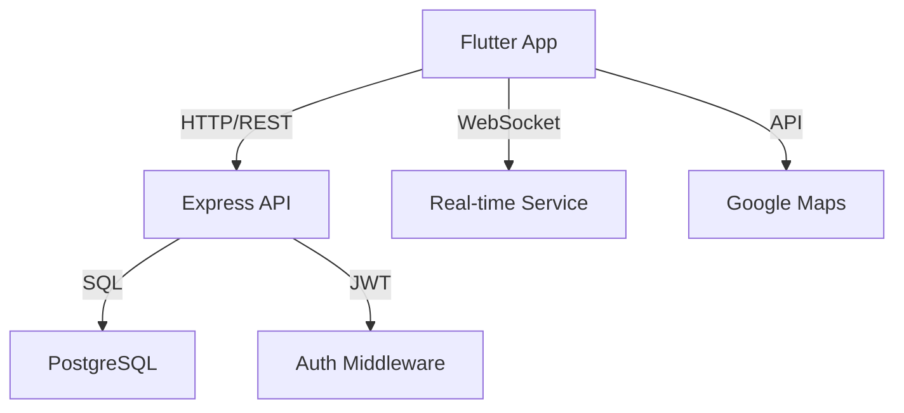
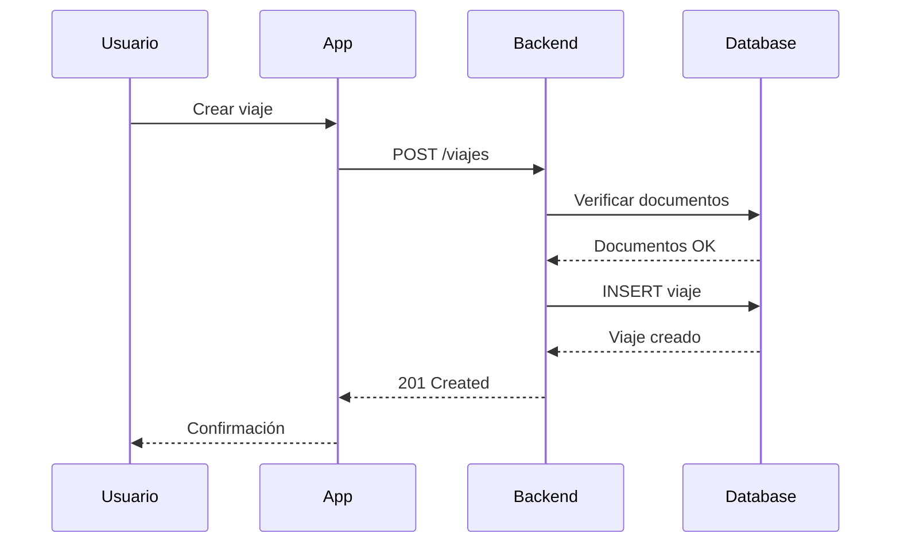
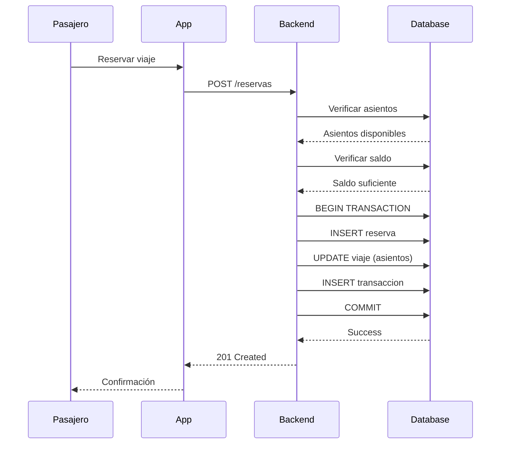
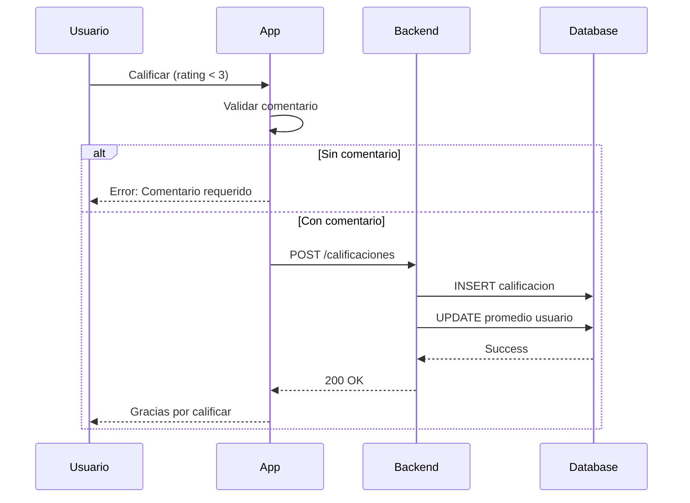

# 📖 Manual Técnico - UniHitch

## Índice
1. [Arquitectura del Sistema](#arquitectura-del-sistema)
2. [Base de Datos](#base-de-datos)
3. [API Endpoints](#api-endpoints)
4. [Flujos de Negocio](#flujos-de-negocio)
5. [Seguridad](#seguridad)
6. [Optimizaciones](#optimizaciones)

## Arquitectura del Sistema

### Diagrama de Componentes



### Capas de la Aplicación

**Capa de Presentación (Flutter)**
- Widgets reutilizables
- State Management (setState)
- Navegación con Navigator
- Servicios HTTP (http package)

**Capa de Negocio (Node.js)**
- Controllers: Lógica de negocio
- Middleware: Validaciones y autenticación
- Validators: Validación de datos

**Capa de Datos (PostgreSQL)**
- Modelo relacional normalizado
- Triggers para auditoría
- Índices para optimización

## Base de Datos

### Diagrama ER

```
┌──────────────┐       ┌──────────────┐       ┌──────────────┐
│   USUARIO    │       │    VIAJE     │       │   RESERVA    │
├──────────────┤       ├──────────────┤       ├──────────────┤
│ id (PK)      │───┐   │ id (PK)      │───┐   │ id (PK)      │
│ nombre       │   │   │ id_conductor │   │   │ id_viaje (FK)│
│ correo       │   └──▶│ (FK)         │   └──▶│ id_pasajero  │
│ password     │       │ origen       │       │ (FK)         │
│ telefono     │       │ destino      │       │ asientos     │
│ rol          │       │ fecha_hora   │       │ precio_total │
│ activo       │       │ precio       │       │ estado       │
│ verificado   │       │ estado       │       └──────────────┘
└──────────────┘       └──────────────┘
```

### Tablas Principales

#### `usuario`
```sql
CREATE TABLE usuario (
    id SERIAL PRIMARY KEY,
    nombre VARCHAR(255) NOT NULL,
    correo VARCHAR(255) UNIQUE NOT NULL,
    password VARCHAR(255) NOT NULL,
    telefono VARCHAR(20) UNIQUE,
    rol VARCHAR(20) DEFAULT 'USER',
    activo BOOLEAN DEFAULT true,
    verificado BOOLEAN DEFAULT false,
    id_universidad INTEGER REFERENCES universidad(id),
    calificacion_promedio DECIMAL(3,2) DEFAULT 0.00,
    created_at TIMESTAMP DEFAULT CURRENT_TIMESTAMP
);
```

#### `viaje`
```sql
CREATE TABLE viaje (
    id SERIAL PRIMARY KEY,
    id_conductor INTEGER REFERENCES usuario(id),
    origen VARCHAR(255) NOT NULL,
    destino VARCHAR(255) NOT NULL,
    fecha_hora TIMESTAMP NOT NULL,
    asientos_totales INTEGER NOT NULL,
    asientos_disponibles INTEGER NOT NULL,
    precio DECIMAL(10,2) NOT NULL,
    estado VARCHAR(20) DEFAULT 'DISPONIBLE',
    created_at TIMESTAMP DEFAULT CURRENT_TIMESTAMP
);
```

#### `reserva`
```sql
CREATE TABLE reserva (
    id SERIAL PRIMARY KEY,
    id_viaje INTEGER REFERENCES viaje(id),
    id_pasajero INTEGER REFERENCES usuario(id),
    asientos INTEGER NOT NULL,
    precio_total DECIMAL(10,2) NOT NULL,
    estado VARCHAR(20) DEFAULT 'PENDIENTE',
    fecha_reserva TIMESTAMP DEFAULT CURRENT_TIMESTAMP
);
```

### Índices

```sql
-- Optimización de búsquedas
CREATE INDEX idx_viaje_fecha ON viaje(fecha_hora);
CREATE INDEX idx_viaje_estado ON viaje(estado);
CREATE INDEX idx_usuario_correo ON usuario(correo);
CREATE INDEX idx_reserva_pasajero ON reserva(id_pasajero);
```

## API Endpoints

### Autenticación

#### `POST /api/auth/register`
**Descripción:** Registra un nuevo usuario

**Request:**
```json
{
  "nombre": "string",
  "correo": "string (email)",
  "password": "string (min 6 chars)",
  "telefono": "string",
  "id_universidad": "integer",
  "codigo_universitario": "string"
}
```

**Response 201:**
```json
{
  "message": "Usuario registrado exitosamente",
  "userId": 123
}
```

**Errores:**
- `400`: Datos inválidos
- `409`: Email ya registrado

#### `POST /api/auth/login`
**Descripción:** Inicia sesión

**Request:**
```json
{
  "correo": "string",
  "password": "string"
}
```

**Response 200:**
```json
{
  "token": "eyJhbGciOiJIUzI1NiIs...",
  "user": {
    "id": 123,
    "nombre": "Juan Pérez",
    "correo": "juan@unp.edu.pe",
    "rol": "USER"
  }
}
```

**Errores:**
- `401`: Credenciales inválidas
- `403`: Cuenta inhabilitada

### Viajes

#### `GET /api/viajes`
**Descripción:** Lista viajes disponibles

**Headers:**
```
Authorization: Bearer {token}
```

**Query Params:**
- `origen` (optional): Filtrar por origen
- `destino` (optional): Filtrar por destino
- `fecha` (optional): Filtrar por fecha

**Response 200:**
```json
[
  {
    "id": 1,
    "conductor": {
      "id": 5,
      "nombre": "María García",
      "calificacion_promedio": 4.8
    },
    "origen": "Universidad de Piura",
    "destino": "Real Plaza",
    "fecha_hora": "2024-12-10T14:00:00Z",
    "asientos_disponibles": 3,
    "precio": 5.00
  }
]
```

#### `POST /api/viajes`
**Descripción:** Crea un nuevo viaje

**Headers:**
```
Authorization: Bearer {token}
```

**Request:**
```json
{
  "origen": "string",
  "destino": "string",
  "fecha_hora": "ISO 8601 datetime",
  "asientos_totales": "integer (1-8)",
  "precio": "decimal"
}
```

**Response 201:**
```json
{
  "id": 123,
  "message": "Viaje creado exitosamente"
}
```

**Errores:**
- `400`: Datos inválidos
- `403`: Documentos no aprobados

### Reservas

#### `POST /api/reservas`
**Descripción:** Crea una reserva

**Request:**
```json
{
  "id_viaje": 123,
  "asientos": 2
}
```

**Response 201:**
```json
{
  "id": 456,
  "precio_total": 10.00,
  "message": "Reserva creada exitosamente"
}
```

**Errores:**
- `400`: Asientos insuficientes
- `402`: Saldo insuficiente

### Wallet

#### `GET /api/wallet`
**Descripción:** Obtiene información de billetera

**Response 200:**
```json
{
  "saldo": 150.50,
  "transacciones_recientes": [
    {
      "id": 789,
      "tipo": "RECARGA",
      "monto": 50.00,
      "fecha": "2024-12-09T10:00:00Z"
    }
  ]
}
```

#### `POST /api/wallet/recharge`
**Descripción:** Solicita recarga de saldo

**Request:**
```json
{
  "monto": 50.00,
  "metodo_pago": "YAPE",
  "comprobante_url": "https://..."
}
```

**Response 201:**
```json
{
  "id": 999,
  "estado": "PENDIENTE",
  "message": "Solicitud de recarga enviada"
}
```

## Flujos de Negocio

### Flujo de Creación de Viaje



### Flujo de Reserva



### Flujo de Calificación



## Seguridad

### Autenticación JWT

**Generación de Token:**
```javascript
const token = jwt.sign(
  {
    id: user.id,
    rol: user.rol,
    id_universidad: user.id_universidad
  },
  process.env.JWT_SECRET,
  { expiresIn: '7d' }
);
```

**Validación de Token:**
```javascript
const authMiddleware = (req, res, next) => {
  const token = req.headers.authorization?.split(' ')[1];
  
  if (!token) {
    return res.status(401).json({ error: 'Token no proporcionado' });
  }
  
  try {
    const decoded = jwt.verify(token, process.env.JWT_SECRET);
    req.user = decoded;
    next();
  } catch (error) {
    return res.status(401).json({ error: 'Token inválido' });
  }
};
```

### Encriptación de Contraseñas

```javascript
// Registro
const hashedPassword = await bcrypt.hash(password, 10);

// Login
const validPassword = await bcrypt.compare(password, user.password);
```

### Validación de Datos

```javascript
const { body, validationResult } = require('express-validator');

const createTripValidation = [
  body('origen').notEmpty().withMessage('Origen requerido'),
  body('destino').notEmpty().withMessage('Destino requerido'),
  body('precio').isFloat({ min: 0 }).withMessage('Precio inválido'),
  body('asientos_totales').isInt({ min: 1, max: 8 })
];
```

## Optimizaciones

### Caching

**Redis para sesiones:**
```javascript
const redis = require('redis');
const client = redis.createClient();

// Cachear datos de usuario
await client.setex(`user:${userId}`, 3600, JSON.stringify(userData));
```

### Paginación

```javascript
const page = parseInt(req.query.page) || 1;
const limit = parseInt(req.query.limit) || 20;
const offset = (page - 1) * limit;

const result = await pool.query(
  'SELECT * FROM viaje LIMIT $1 OFFSET $2',
  [limit, offset]
);
```

### Índices de Base de Datos

```sql
-- Índice compuesto para búsquedas frecuentes
CREATE INDEX idx_viaje_search ON viaje(estado, fecha_hora, origen);

-- Índice para ordenamiento
CREATE INDEX idx_usuario_rating ON usuario(calificacion_promedio DESC);
```

### Query Optimization

```javascript
// Malo: N+1 queries
for (const trip of trips) {
  trip.conductor = await getUser(trip.id_conductor);
}

// Bueno: JOIN
const result = await pool.query(`
  SELECT v.*, u.nombre as conductor_nombre, u.calificacion_promedio
  FROM viaje v
  JOIN usuario u ON v.id_conductor = u.id
  WHERE v.estado = 'DISPONIBLE'
`);
```

## Monitoreo y Logs

### Logging

```javascript
const winston = require('winston');

const logger = winston.createLogger({
  level: 'info',
  format: winston.format.json(),
  transports: [
    new winston.transports.File({ filename: 'error.log', level: 'error' }),
    new winston.transports.File({ filename: 'combined.log' })
  ]
});

// Uso
logger.info('Usuario registrado', { userId: user.id });
logger.error('Error en creación de viaje', { error: err.message });
```

### Métricas

```javascript
const prometheus = require('prom-client');

const httpRequestDuration = new prometheus.Histogram({
  name: 'http_request_duration_seconds',
  help: 'Duration of HTTP requests in seconds',
  labelNames: ['method', 'route', 'status_code']
});
```

## Troubleshooting

### Problemas Comunes

**Error 401 en requests:**
- Verificar que el token se envíe en headers
- Verificar que el token no haya expirado
- Verificar JWT_SECRET en .env

**Error de conexión a DB:**
- Verificar credenciales en .env
- Verificar que PostgreSQL esté corriendo
- Verificar firewall/puertos

**Flutter no conecta al backend:**
- Verificar Config.apiUrl
- En Android: usar IP local (no localhost)
- Verificar CORS en backend

---

**Última actualización:** Diciembre 2024
